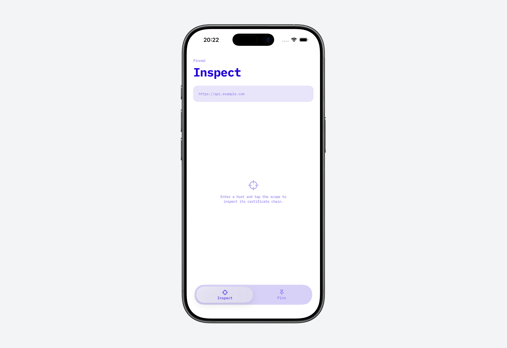
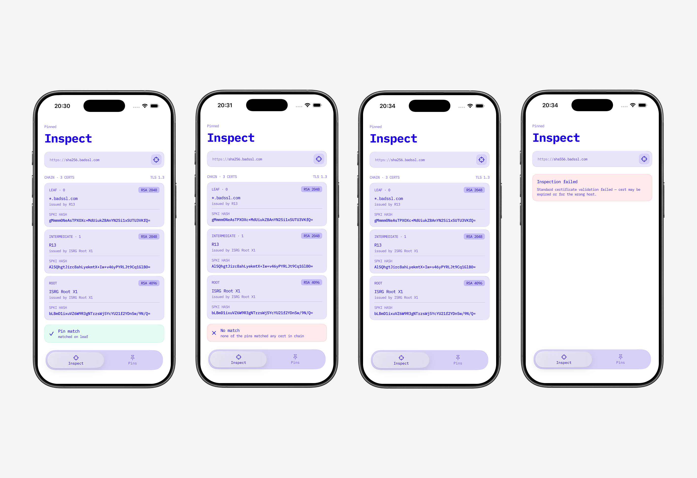
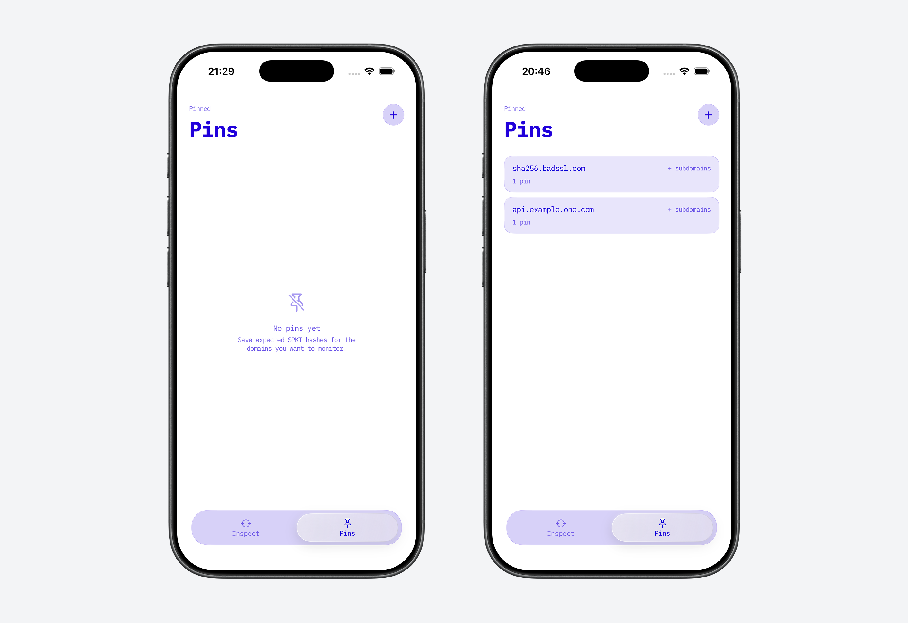
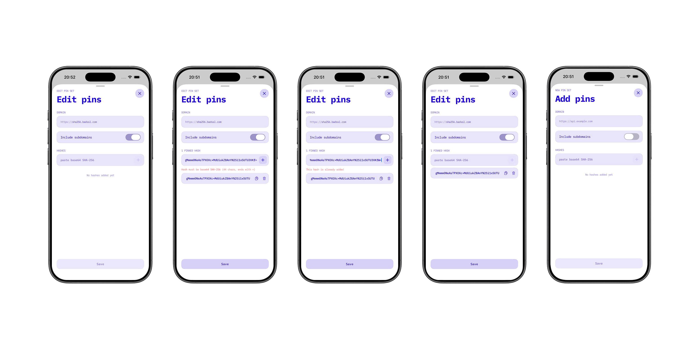

<h1>
  
  Pinned - TLS Certificate Chain Inspector & SPKI Pin Matcher
</h1>

A native iOS application built with **SwiftUI**, **Core Data**, **MVVM**, the **Security framework**, and **CryptoKit** for inspecting a server's live TLS certificate chain, computing **SPKI pins**, and matching them against user-defined pins.

This project was designed to showcase not only feature delivery, but also **architecture discipline**, **clear separation of responsibilities**, and the ability to reach below high-level APIs (raw DER parsing, manual SPKI reconstruction, TLS handshake interception) where Apple's SDK offers no public iOS surface.

---

## Overview

Pinned is a developer-oriented diagnostic tool focused on one question: *if I shipped these pins in a real app, would they match what this server actually presents?*

- inspect any host's live TLS certificate chain by entering a URL,
- view each certificate's subject, issuer, key type, validity, and **SPKI hash**,
- save **pin sets** (a domain plus one or more SPKI hashes),
- match an inspected chain against saved pins and see a clear verdict,
- support exact-domain and subdomain (wildcard-parent) pin resolution.

The application intentionally stays within a compact product scope, while demonstrating patterns expected in a production-oriented iOS codebase:

- **a UI-free certificate engine isolated in a dedicated `Core/` layer**,
- **view logic encapsulated in ViewModels using the Observation framework**,
- **persistence isolated behind a repository protocol**,
- **all `Security` / `SecTrust` interaction confined to a single layer**,
- **a hand-rolled DER/X.509 parser, because the equivalent API is macOS-only**,
- **a fully `Sendable`-correct concurrency model**,
- **unit test coverage across parsing, hashing, matching, persistence, and ViewModels**.

---

## SPKI pinning, not certificate pinning

This is the core idea of the project, and the distinction matters.

**Certificate pinning** stores a hash of the *entire certificate*. It is brittle: certificates rotate constantly (renewals, short-lived ACME/Let's Encrypt certs), and every rotation breaks the pin even when the server's identity hasn't changed.

**SPKI pinning** - what this app does - stores the SHA-256 of the certificate's `SubjectPublicKeyInfo`: the public key *plus* its algorithm identifier. As long as the server keeps the same key pair across renewals, the pin survives. This is the approach used by TrustKit and the wider industry; it is the robust, production-grade way to pin.

Just as important: **Pinned is an inspector, not a validator.** It never blocks a connection. It always completes the TLS handshake, extracts the chain, computes the SPKI hashes, and compares them against your saved pins purely to *report* whether they would match. The intended use is verifying that your pins are correct **before** you embed them in a real app's enforcing pinning layer - surfacing mismatches early instead of discovering them in production.

---

## Product walkthrough

### 1. Inspect

The Inspect tab is the entry point. The user types a host (`api.example.com`) or a full URL, taps inspect, and the app performs a live TLS handshake to pull down the certificate chain.

The screen is driven by an explicit set of UI states - `idle`, `loading`, `results`, `error` - so every asynchronous transition is visible and unambiguous.

<p align="center">
  
</p>

### 2. Inspection results

Each certificate in the chain is rendered as a card showing:

- its position (leaf, intermediate, root),
- subject and issuer common names,
- key type (RSA 2048/4096, ECDSA P-256/P-384, Ed25519),
- the computed **SPKI hash** - the would-be pin for that CA - selectable for copy.

The results area resolves into one of four states, shown below from left to right:

1. **Matched** - a saved pin matched a certificate in the chain. A green banner confirms the verdict and reports where it matched (e.g. *matched on leaf*).
2. **No match** - a pin set exists for the domain, but none of its hashes matched any certificate in the chain. A red *mismatch* banner is shown.
3. **No pins for domain** - no pin set is saved for this host, so there is no verdict to give. The banner is hidden and the screen simply lists the chain with each certificate's SPKI hash.
4. **Inspection failed** - the host could not be inspected (invalid URL, TLS handshake failure, failed CA validation, …). The chain is replaced by an error card titled *Inspection failed* explaining what went wrong.

States 1-3 share the same chain view and differ only in the banner beneath it; state 4 replaces the chain entirely.

<p align="center">
  
</p>

### 3. Pins

The Pins tab lists all saved pin sets, each showing its domain, a subdomains badge when enabled, and a pin count. Sets can be edited by tapping or removed with a swipe.

An empty state guides the user toward creating their first pin.

<p align="center">
  
</p>

### 4. Create / edit pin

The pin editor lets the user enter a domain, toggle subdomain coverage, and add one or more SPKI hashes. Each hash is validated on entry (44-character, `=`-padded, decodable base64) and checked for duplicates before it is accepted.

<p align="center">
  
</p>

---

## Architecture

The project follows a **SwiftUI + MVVM** approach, with composition wired in the app entry point and the certificate engine extracted into a standalone, UI-free layer.

### Why this architecture

For an app of this size, this architecture gives a strong balance between:

- readability,
- testability of non-UI logic,
- a clean boundary between the certificate engine and the UI,
- maintainability as features grow.

It keeps data mutation out of views, isolates persistence behind a repository, and - most importantly here - confines every `Security`-framework call to a single layer so the rest of the app works only with plain, `Sendable` domain models.

### Composition

`PinnedApp` acts as the composition root. At launch it builds the Core Data stack (`PinStore`), wraps it in a `CoreDataPinRepository`, and injects that single repository into both ViewModels. Dependencies are constructed once and passed down - never resolved from global scope - which makes it trivial to substitute an `InMemoryPinRepository` or a `StubCertificateInspector` for previews and tests.

### Navigation

Navigation is deliberately lightweight: `RootView` switches between the Inspect and Pins tabs via a custom `TabBarChrome`, and the Pins flow presents its editor as a sheet driven by an `Identifiable` `PinsRoute` (`.create` / `.edit`). No heavier router is introduced because the flow graph doesn't warrant one.

### Presentation layer

Each feature exposes a ViewModel built with the **Observation** framework (`@Observable`, `@MainActor`):

- `InspectViewModel` - owns the inspect state machine and orchestrates inspector -> repository -> matcher,
- `PinsViewModel` - list state with optimistic create/update/delete and rollback on failure,
- `PinUpsertViewModel` - editor state, hash validation, and `PinSet` construction.

### Persistence layer

Persistence is built on **Core Data**, behind a `PinRepository` protocol:

- `PinRepository` (protocol),
- `CoreDataPinRepository` (production, background-context writes),
- `InMemoryPinRepository` (an actor-based test double with injectable failure modes).

This keeps storage concerns localized and lets the entire app - and every test - depend on the protocol rather than Core Data.

### Certificate engine (Core)

The pinning logic lives in a standalone **`Core/` layer with no SwiftUI or UIKit dependency** - it could be lifted into its own Swift package unchanged. It is split into focused, single-responsibility types, each independently testable:

- `URLSessionCertificateInspector` - TLS handshake interception,
- `ChainExtractor` - `SecTrust` -> domain `CertificateChain`,
- `SPKIHasher` + `ASN1Headers` + `KeyTypeDetector` - SPKI reconstruction and hashing,
- `DERReader` + `X509Metadata` - raw DER/X.509 parsing,
- `PinMatcher` - domain resolution and hash matching.

Keeping the engine out of the feature layer means a second feature could reuse it without importing anyone else's UI, and the whole engine is exercised by tests that never launch a view. Handshake interception, hashing, DER parsing, and matching all have completely different failure modes and evolve independently, so each is its own type.

---

## Feature breakdown

### Chain inspection

The app connects to a host, intercepts the TLS handshake, and surfaces the full certificate chain with a computed SPKI hash per certificate. Inspection never enforces - a chain is shown even when it matches no pins, so the user can compare it against what they expected.

### Pin management

The app supports the full CRUD lifecycle for pin sets:

- create a pin set with a domain and one or more SPKI hashes,
- toggle subdomain coverage,
- edit domain, hashes, and the subdomains flag,
- delete via swipe,
- per-hash validation (format + duplicate detection) before a hash is accepted.

Pin sets are sorted by creation date, and edits preserve the original identity (`id` and `createdAt`) so an update never duplicates an entry.

### Pin matching

A chain matches if any saved hash matches any certificate in the chain (first match wins, mirroring TrustKit). Domain resolution is case-insensitive and port-insensitive, and supports parent-domain coverage when `includeSubdomains` is enabled. The matched position is reported back - a hit on the intermediate rather than the leaf is a hint that the leaf pin is stale and should be rotated.

---

## SPKI pinning pipeline details

The inspection flow chains six stages, each marked in the logs with a 🔑 milestone so the pipeline is traceable end to end.

### How it works

```text
URL submit -> InspectViewModel.inspect()
          -> [1/6] URLSessionCertificateInspector - HEAD request triggers the TLS handshake
          -> [2/6] TrustCapturingDelegate - captures SecTrust from the auth challenge
          -> [3/6] SecTrustEvaluateWithError - baseline CA validation (chain, expiry, hostname)
          -> [4/6] ChainExtractor - copies the chain out of SecTrust into Sendable models
          -> [5/6] SPKIHasher - rebuilds SubjectPublicKeyInfo -> SHA-256 -> base64  (the pin)
          -> [6/6] PinMatcher - compares computed hashes against saved pins
          -> InspectViewModel renders the chain + match verdict
```

**Handshake interception** - A plain `URLSession` request never exposes the server's certificates; the system validates them internally and returns only the response. To reach the chain, `URLSessionCertificateInspector` issues a `HEAD` request purely to trigger a handshake and intercepts it via a `URLSessionDelegate`, reading the `SecTrust` out of the authentication challenge. This is the only hook where the raw chain is reachable.

**Baseline CA validation** - Before any pinning logic runs, the chain passes standard system validation (`SecTrustEvaluateWithError`): CA chain, expiry, hostname policy. Pinning is layered *on top of* this, never instead of it - a pinned-but-expired certificate must still fail.

**Chain extraction** - `ChainExtractor` maps the opaque `SecTrust` into a `Sendable` `CertificateChain`, confining every `SecTrust` / `SecCertificate` / `SecKey` call to one place. Issuer and validity dates are read from raw DER (see below); subject summaries come from `SecCertificateCopySubjectSummary`.

**SPKI hashing** - `SPKIHasher` produces a hash that is byte-for-byte identical to the OpenSSL pipeline (`x509 -pubkey | pkey -outform der | dgst -sha256 -binary | enc -base64`). The subtlety: `SecKeyCopyExternalRepresentation` returns only the *raw* key material, so the matching ASN.1 algorithm header (from `ASN1Headers`) must be prepended to rebuild the full `SubjectPublicKeyInfo` before hashing. Get the header wrong and the digest silently diverges from OpenSSL/TrustKit - the single most common way hand-rolled pinning breaks.

**Manual DER parsing** - `SecCertificateCopyValues` and the `kSecOID…` constants are macOS-only, so there is no public iOS API to read the issuer CN or the validity window. `DERReader` is a small, crash-proof Tag-Length-Value cursor, and `X509Metadata` walks the `TBSCertificate` with it to extract exactly the fields the UI needs. Every bounds check returns `nil` instead of trapping - a parser that crashes on hostile network input is a security bug, not just a robustness one.

**Matching** - `PinMatcher` resolves the applicable pin set for the host (exact, then parent domain when subdomains are enabled), normalizes away any `:port`, and returns the matched position or a mismatch.

---

## Data model

Persistence uses a single Core Data entity mapped to a clean domain model:

```text
PinSetEntity (id, domain, includeSubdomains, createdAt, hashesData)
        └── hashesData : [String] encoded as JSON Data
```

The `[String]` list of hashes is JSON-encoded into a single `Data` column rather than modeled as a Core Data relationship - pragmatic for an ordered, value-type list of this size. Mapping lives in `PinSetEntity+Mapping` (`apply(_:)` / `toDomain()`), and decode/encode failures are surfaced as typed `RepositoryError` cases carrying the offending `id`.

The domain `PinSet` is a `Sendable`, `Hashable` value type, so nothing above the persistence layer ever touches an `NSManagedObject`.

---

## Networking

The certificate engine is the networking layer - there is no generic HTTP client, because the app's only network operation is the handshake itself. The design choices worth noting:

- the inspector uses an `.ephemeral` `URLSession` so no certificates are cached between inspections,
- the `TrustCapturingDelegate` serialises its single mutable field behind an `NSLock`, making it `@unchecked Sendable` for a clear, audited reason,
- a rejection triggered during validation is preserved and rethrown, so the user sees a meaningful error rather than URLSession's generic "cancelled",
- the inspector accepts the connection unconditionally (`.useCredential`) - it inspects, it never blocks.

---

## Design system

The UI is built on a small, consistent design system:

- **glass cards** via iOS 26's `glassEffect`, with a graceful `ultraThinMaterial` fallback on earlier versions,
- a custom **glass tab bar** with a `matchedGeometryEffect` selection bubble,
- **IBM Plex Mono** typography exposed through typed `PlexTextStyle` tokens,
- centralized semantic **colors** (text, background, glass fills, match success/failure),
- reusable `GlassButton`, `IconButton`, and `URLInputField` components.

All user-facing strings are routed through `LocalizedStringResource`, keeping copy out of the views.

---

## Testing

The project includes a dedicated `PinnedTests` target built on the **Swift Testing** framework (`@Suite` / `@Test`), with logic split so failures point directly at the layer that broke.

### Test infrastructure

- `CertificateFactory` - builds `Certificate` / `CertificateChain` fixtures with chosen SPKI hashes,
- `PinSetFactory` - `PinSet` fixtures with valid base64 hashes and a stable time base,
- `CoreDataTestStack` - an in-memory Core Data stack and repository for isolated persistence tests,
- `InMemoryPinRepository` - an actor-based double with injectable `onFetch` / `onSave` / `onDelete` failures.

### Coverage

**Parsing** - `DERReaderTests` covers nested TLVs, long-form length decoding (> 127 bytes), absolute child ranges, and graceful `nil` on truncated input. `CertificateChainTests` verifies leaf/intermediate/root position logic.

**Matching** - `PinMatcherTests` covers exact and case-insensitive matches, subdomain resolution (with and without the flag), empty-hash handling, position reporting, first-match-wins, and the port-in-domain normalization case.

**Persistence** - `CoreDataPinRepositoryTests`, `InMemoryPinRepositoryTests`, and `PinSetEntityMappingTests` verify round-trips, upsert-by-id, ordering, deletion, failure injection, and corrupted-data error mapping.

**ViewModels** - `InspectVMTests`, `PinsVMTests`, and `PinUpsertVMTests` verify state transitions, error propagation, optimistic update + rollback, hash validation, and `PinSet` construction - all without networking or Core Data.

---

## Project structure

A simple way to think about the structure is:

```text
Pinned/
├── App/
│   ├── Launch/
│   │   └── Views/                      LaunchScreen
│   ├── PinnedApp                       (composition root)
│   └── RootView
│
├── Core/                               <- UI-free engine, no SwiftUI / UIKit
│   ├── Certificate/
│   │   ├── Crypto/                     ASN1Headers, KeyTypeDetector, SPKIHasher
│   │   ├── Parsing/                    DERReader, X509Metadata
│   │   ├── CertificateInspector        (protocol)
│   │   ├── ChainExtractor
│   │   └── URLSessionCertificateInspector
│   └── Pinning/
│       └── PinMatcher
│
├── DesignSystem/
│   ├── Buttons/                        GlassButton, IconButton
│   ├── TabBar/                         TabBarChrome
│   ├── TextField/                      URLInputField
│   ├── View/                           GlassCard
│   ├── Colors
│   ├── Localization
│   └── Typography
│
├── Features/
│   ├── Inspect/
│   │   ├── Components/                 CertificateCardView, CertificateChainView, MatchStatusBanner
│   │   ├── Mocks/                      StubCertificateInspector
│   │   ├── InspectView
│   │   └── InspectViewModel
│   └── Pins/
│       ├── Components/                 PinRowView
│       ├── List/                       PinsView, PinsViewModel
│       ├── Navigation/                 PinsRoute
│       └── Upsert/
│           ├── Components/             UpsertHashRow
│           ├── PinUpsertView
│           └── PinUpsertViewModel
│
├── Models/
│   ├── Certificate/                    Certificate, CertificateChain, KeyType
│   ├── Error/                          InspectionError
│   ├── Match/                          MatchResult
│   └── Pin/                            PinSet
│
├── Persistence/
│   ├── Entities/                       PinSetEntity, PinSetEntity+Mapping
│   ├── Repository/
│   │   ├── Errors/                     RepositoryError
│   │   ├── Mocks/                      InMemoryPinRepository
│   │   ├── CoreDataPinRepository
│   │   └── PinRepository               (protocol)
│   ├── Stack/                          PinStore
│   └── Pinned.xcdatamodeld
│
└── Resources/
    ├── Fonts/                          IBM Plex Mono (Thin -> Bold)
    ├── Localizable/                    Localizable
    ├── Logging/                        Log, LogType
    ├── Assets
    └── Info.plist

PinnedTests/
├── Domain/                             CertificateChainTests
├── Inspection/                         DERReaderTests
├── Matching/                           PinMatcherTests
├── Persistence/                        CoreDataPinRepositoryTests, InMemoryPinRepositoryTests,
│                                       PinSetEntityMappingTests
├── Support/                            CertificateFactory, CoreDataTestStack, PinSetFactory
└── ViewModels/                         InspectVMTests, PinsVMTests, PinUpsertVMTests

PinnedUITests/
```

---

## Running the project

### Setup

1. Clone the repository.
2. Open the Xcode project.
3. Build and run on simulator or device.

There are no API keys or external services to configure - the app only needs network access to perform a handshake against the host you inspect.

### Trying it out

Enter a host such as `badssl.com`, `github.com`, or any HTTPS endpoint, inspect it, copy a leaf SPKI hash from the result, and save it as a pin for that domain. Re-inspecting will then report a match.

### Verifying a pin with OpenSSL

Because the app's SPKI hash is byte-for-byte identical to OpenSSL's, you can derive the exact same pin from the command line - useful for sanity-checking the app, or for grabbing a known-good pin to test matching with.

This connects to a live host, takes its **leaf** certificate, rebuilds the `SubjectPublicKeyInfo`, and prints the base64 SHA-256 - the value the app should show for the leaf:

```bash
openssl s_client -connect github.com:443 -servername github.com </dev/null 2>/dev/null \
  | openssl x509 -pubkey -noout \
  | openssl pkey -pubin -outform der \
  | openssl dgst -sha256 -binary \
  | openssl enc -base64
```

Paste the result as a pin for `github.com`; re-inspecting in the app should now report **matched on leaf**. For a certificate already saved to disk, swap the first line for:

```bash
openssl x509 -in cert.pem -pubkey -noout \
  | openssl pkey -pubin -outform der \
  | openssl dgst -sha256 -binary \
  | openssl enc -base64
```

> The one-liner above pins the leaf only. To verify an intermediate or root pin, extract that certificate from the chain first (e.g. `openssl s_client -showcerts …`) and feed it through the same `x509 -pubkey … | dgst -sha256 | enc -base64` tail.

---

## Logging & diagnostics

Diagnostics run through a small typed `Log` facility (`info`, `debug`, `warning`, `error`, plus init/deinit and database markers), with output gated per `LogType` and enabled only in `DEBUG`.

The SPKI pinning pipeline is instrumented with 🔑-prefixed milestones (`[1/6]` … `[6/6]`) so a single inspection can be followed end to end in the console - from the handshake, through CA validation and chain extraction, to the SPKI hash computation and the final match. Each milestone log doubles as documentation of *why* that step exists.
